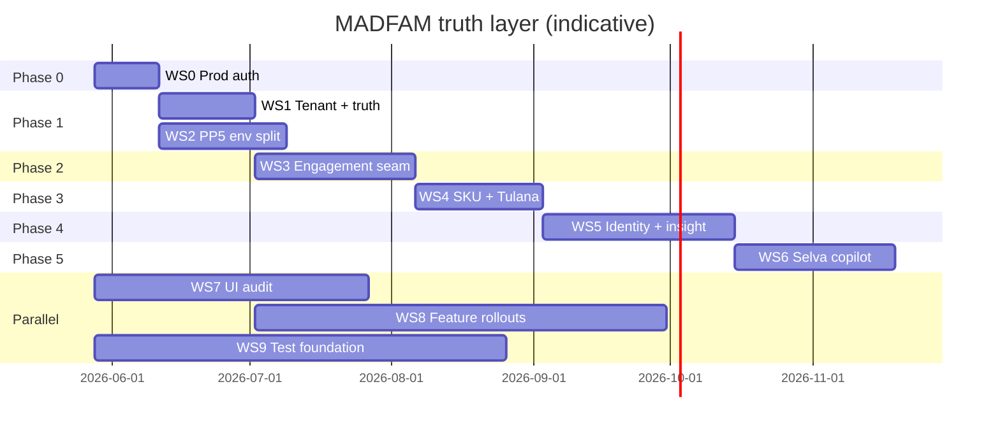

# MADFAM truth layer — full remediation and implementation plan

> **Purpose:** Executable plan to move the `crm.madfam.io` / `admin@madfam.io`
> tenant slice from ~25–35% toward **100% truthful, ecosystem-integrated,
> sales-pilot-ready** operation for human reps and Selva agents.
>
> **Last updated:** 2026-05-28  
> **Roadmap index:** [`ROADMAP.md`](./ROADMAP.md)  
> **Prod baseline:** [`CODEBASE_AND_PROD_EVIDENCE_2026-05-27.md`](./CODEBASE_AND_PROD_EVIDENCE_2026-05-27.md)

## Executive summary

Phynd CRM is production-capable as a **CRM + federation seam** but not yet a
**complete MADFAM ecosystem truth layer**. The gap is not primarily missing UI —
it is **access, data honesty, ecosystem coverage, SKU modeling, and agent APIs**.

This plan organizes remediation into **10 workstreams (WS0–WS9)** across **6
phases**. Phases 0–1 are prerequisites for any truthful sales pilot. Phases 2–3
unlock ecosystem and SKU completeness. Phases 4–5 deliver insight scale and
Selva copilot readiness.



---

## Problem statement (evidence-based)

### 1. Tenant slice is branding-first (partially remediated 2026-05-28)

- `apps/web/src/lib/branding/tenant-brand.ts` maps `crm.madfam.io` → `tenantId: 'madfam'`.
- **Shipped:** `resolveTenantIdFromHeaders()` in tRPC, GraphQL, and `getServerCaller()` via `resolveAuthContext()`.
- **Shipped:** `getDb(tenantId)` in `createAppContext()` / `createAppContextFromRequest()`.
- **Remaining:** single `DATABASE_URL` for pilot; optional per-tenant URLs documented in [`TENANT_DATABASE_STRATEGY.md`](./TENANT_DATABASE_STRATEGY.md).

**Impact:** Host-derived tenant context is wired; row-level / DB split is still future work.

### 2. Federation can lie silently in prod (remediated 2026-05-28)

- **Shipped:** mock federation fallback disabled when `NODE_ENV=production`.
- **Shipped:** Tezca returns honest `unavailable` without silent `ok`.
- Dev-only Tablaco mock registry remains for local seed workflows.

### 3. Ecosystem coverage is partial

| Integration class | Services | In unified profile? | Webhook to Phynd? |
| --- | --- | --- | --- |
| Federation read | Janua, Dhanam, Cotiza, Pravara, Forj, Janua Telemetry | Yes | Partial |
| Webhook-only | Fortuna, Karafiel, RouteCraft, Tezca, Avala, Coforma, CEQ | No | Yes |
| Engagement writers | Pravara, Selva, Karafiel | N/A | **Shipped** (when secrets + payload present) |
| SKU / campaigns | Tulana | CRM-native | **Shipped** (`/api/v1/campaigns/*`) |

### 4. Selva agent surface (remediated 2026-05-28)

- **Shipped:** `FEDERATION_API_TOKEN` → `service:selva` with expanded read scopes + `aiKanban:write`.
- **Shipped:** tRPC + GraphQL bearer auth via `createAppContextFromRequest()`.
- **Shipped:** [`SELVA_CRM_AGENT_TOOLS.md`](./SELVA_CRM_AGENT_TOOLS.md), `pnpm verify:selva-agent`.

### 5. Production auth blocks staff pilot

- Auth.js provider metadata leaks internal pod host (fix coded, deploy unverified).
- Janua `CallbackRouteError` in Enclii logs.

---

## Workstreams

### WS0 — Production access truth (Phase 0)

**Owner:** Phynd CRM (web) + Janua + Enclii  
**Priority:** P0 — blocks all prod sales use

#### Tasks

| ID | Task | Implementation notes |
| --- | --- | --- |
| WS0.1 | Deploy auth origin normalization | Ship `normalizeAuthRequest()` in prod web image |
| WS0.2 | Post-deploy verification script | `pnpm verify:prod-auth` — public hosts + callback host alignment |
| WS0.3 | Janua OIDC client audit | Redirect URIs for `phynd.app`, `crm.madfam.io`, `crm.phynd.app` |
| WS0.4 | `admin@madfam.io` claims | Ensure Janua user has admin role/scopes accepted by Phynd middleware |
| WS0.5 | Enclii domain reconciliation | Align junctions with `.enclii.yml` declared domains |

#### Acceptance tests

```bash
pnpm verify:prod-auth
# Providers must not reference internal pod hostnames; callbackUrl host must match request base

# Staff login E2E (manual or Playwright with Janua test user)
# admin@madfam.io → crm.madfam.io/overview → 200, dashboard renders
```

#### Exit criteria

- [ ] `admin@madfam.io` completes Janua SSO on `crm.madfam.io` without callback error
- [ ] `/api/auth/providers` returns only public origins
- [ ] Enclii junction list matches declared production domains or documented deviation

---

### WS1 — Tenant resolution and data honesty (Phase 1)

**Owner:** Phynd CRM  
**Priority:** P0  
**Depends on:** WS0 for prod verification

#### Tasks

| ID | Task | Files / approach |
| --- | --- | --- |
| WS1.1 | Resolve `tenantId` from request host in tRPC + API routes | **Shipped** |
| WS1.2 | Pass `tenantId` to `getDb(tenantId)` in server caller | **Shipped** |
| WS1.3 | Disable mock federation fallback in production | **Shipped** |
| WS1.4 | Honest Tezca status | **Shipped** |
| WS1.5 | Federation tab loading UX | **Shipped** — `clients/[id]/loading.tsx` |
| WS1.6 | Prod federation health banner on contact detail | **Shipped** |
| WS1.7 | Document tenant DB strategy | **Shipped** — [`TENANT_DATABASE_STRATEGY.md`](./TENANT_DATABASE_STRATEGY.md) |

#### Acceptance tests

- Unit: `getServerCaller()` assigns `madfam` for `crm.madfam.io` host header.
- Unit: mock fallback returns `null` when `NODE_ENV=production`.
- E2E: contact with missing providers shows explicit unavailable state, not Tablaco mock (unless `externalJanuaId=janua-tablaco-001` in dev only).

#### Exit criteria

- [x] Host-derived tenantId in all server contexts (2026-05-28)
- [x] No mock federation data served in production (2026-05-28)
- [x] Contact federation UI never blank >200ms without skeleton (`loading.tsx`, 2026-05-28)

---

### WS2 — PP.5 environment split and webhook truth (Phase 1)

**Owner:** Platform + provider teams + Phynd CRM  
**Priority:** P0  
**Canonical doc:** [`PP_5_FULL_REMEDIATION_PLAN.md`](./PP_5_FULL_REMEDIATION_PLAN.md)

#### Tasks

| ID | Task | Reference |
| --- | --- | --- |
| WS2.1 | `staging-phynd.app` ingress + TLS | PP.5 audit row 12 |
| WS2.2 | Populate `phynd-crm-staging-secrets` | **Shipped** template + validator + ExternalSecret keys (Selva/Tulana/tier) |
| WS2.3 | Provider webhook dual-registration (prod + staging) | [`PP_5_PROVIDER_HANDOFF_MATRIX.md`](./PP_5_PROVIDER_HANDOFF_MATRIX.md) |
| WS2.4 | Run probe batches A–D with evidence | `pnpm pp5:probe-batch` |
| WS2.5 | Nightly masked prod→staging refresh | RFC 0001 row 19; interim `pp5-staging-refresh.yml` |
| WS2.6 | `pnpm pp5:readiness --include-wave0` green | Closeout in [`PP5_CLOSEOUT_ACTIONS.md`](./PP5_CLOSEOUT_ACTIONS.md) |
| WS2.7 | Pilot go-live runbook + pre-flight script | **Shipped** — [`runbooks/PILOT_GO_LIVE.md`](./runbooks/PILOT_GO_LIVE.md), `pnpm verify:pilot-go-live` |

#### Exit criteria

- [ ] Staging health 200 externally
- [ ] Every active inbound webhook has distinct staging secret + verified signature path
- [ ] Outbound Phynd→Karafiel/Cotiza/Dhanam uses staging URLs from staging namespace only
- [ ] Production isolation proofs attached per provider lane

---

### WS3 — Engagement ecosystem completion (Phase 2)

**Owner:** Phynd CRM + Selva + Karafiel + Pravara  
**Priority:** P1  
**Taxonomy:** [`ENGAGEMENT_EVENT_TAXONOMY.md`](./ENGAGEMENT_EVENT_TAXONOMY.md)

#### Tasks

| ID | Task | Details |
| --- | --- | --- |
| WS3.1 | Selva milestone → `POST /api/v1/engagements/events` | HMAC `PHYND_ENGAGEMENT_EVENTS_SECRET`; canonical + native event pair |
| WS3.2 | Karafiel stamping → engagement events | `cfdi_stamped`, `nom151_sealed` aliases per taxonomy |
| WS3.3 | Pravara payload `engagementId` | Skip contact lookup when payload carries explicit ID |
| WS3.4 | Karafiel read panel on unified profile | Compliance summary federated read (new provider adapter or engagement artifact rollup) |
| WS3.5 | Portal timeline filters by canonical milestone | Source-agnostic filters for client portal |

#### Acceptance tests

- Service: idempotent `dedup_key` for Selva + Karafiel events (extend `engagements.service.test.ts`).
- Integration: Selva staging POST → row in `engagement_events` → visible on `/portal/[id]`.
- Runbook: update [`runbooks/TABLACO_ENGAGEMENT.md`](./runbooks/TABLACO_ENGAGEMENT.md) Step 6 from "pending" to verified.

#### Exit criteria

- [ ] Selva + Karafiel producers documented and verified in staging
- [ ] Tablaco-class engagement shows fab + digital + compliance milestones without manual staff updates

---

### WS4 — SKU catalog and Tulana campaign loop (Phase 3)

**Owner:** Phynd CRM + Tulana + Selva  
**Priority:** P1  
**Contract:** [`TULANA_SKU_CAMPAIGN_INPUTS_2026-05-29.md`](./TULANA_SKU_CAMPAIGN_INPUTS_2026-05-29.md)

#### Schema (proposed)

```
sku_catalog
  id, sku_key (unique), platform, audience, ga_readiness, metadata, created_at

campaign_sku_extensions (or JSON on campaigns)
  campaign_id, sku_key, proof_points, guardrails, idempotency_key, source, orchestrator

campaign_states (extend)
  draft_imported | needs_review | approved | scheduled | sent | suppressed | rejected | completed
```

#### Tasks

| ID | Task | Details |
| --- | --- | --- |
| WS4.1 | Migration `0008_*` for SKU tables | Drizzle schema under `packages/db/src/schema/` |
| WS4.2 | `POST /api/v1/campaigns/import` | HMAC auth; Zod schema from Tulana doc; idempotent on `idempotency_key` |
| WS4.3 | BullMQ `campaign-import` processor (optional) | For large batch imports via Selva |
| WS4.4 | Campaign review UI | **Shipped** — filters, review dialog, approve/reject |
| WS4.5 | Send gates | **Shipped** — consent, suppression, channel checks; `POST /api/v1/campaigns/send` |
| WS4.6 | Buyer-signal export | **Shipped** — `campaign_buyer_signals` + `POST /api/v1/campaigns/buyer-signals` |
| WS4.7 | tRPC `campaigns.importFromTulana` (staff) | Admin-gated alternative to HTTP import |

#### Acceptance tests

- Schema validation for sample Tulana payload (doc § Required input).
- Idempotent import: duplicate `idempotency_key` → 200, no duplicate campaign.
- Guardrail: `ga_readiness=near_ready` cannot approve copy claiming full GA.
- Export: buyer-signal event contains no raw email/phone.

#### Exit criteria

- [ ] At least one Tulana SKU imported end-to-end in staging
- [ ] Human reviewer can approve/reject with guardrails enforced
- [ ] Tulana receives ≥1 buyer-signal event from staging pilot

---

### WS5 — Identity graph and sales insight (Phase 4)

**Owner:** Phynd CRM + Janua Telemetry  
**Priority:** P2

#### Tasks

| ID | Task | Details |
| --- | --- | --- |
| WS5.1 | Verify prod `janua-telemetry` webhook + `session-identify` worker | **Shipped** — `visitor.identified` + tenant-aware worker |
| WS5.2 | Janua `user.created` linking audit | Newsletter/interest → contact dedup in prod |
| WS5.3 | Cross-SKU analytics dashboard | Requires WS4; funnel by `sku_key` + campaign |
| WS5.4 | RouteCraft attribution in analytics | **Shipped** — `paymentAttributionSummary` + `/analytics` card; routecraft webhook links `campaignId` |
| WS5.5 | Weighted pipeline + at-risk deals fed with live federation value | Optional enrichment from Dhanam/Cotiza |
| WS5.6 | Replace synthetic seed contacts in prod | Operational: import real MADFAM CRM contacts or sync from Janua |

#### Exit criteria

- [ ] Visitor page shows identified sessions from live telemetry (not seed-only)
- [ ] Analytics page includes SKU funnel (post WS4)
- [ ] Sales can answer "pipeline by SKU" from CRM without spreadsheets

---

### WS6 — Selva sales copilot API (Phase 5)

**Owner:** Phynd CRM + Selva  
**Priority:** P2  
**Depends on:** WS1 (truth), WS4 (SKU context)

#### Tasks

| ID | Task | Details |
| --- | --- | --- |
| WS6.1 | Scope expansion for `SERVICE_AUTH` | **Partial** — +contacts, opps, unifiedProfile, engagements, search (2026-05-28) |
| WS6.2 | Router-level scope enforcement middleware | **Shipped** — `enforceServiceScopes` in `packages/api/src/trpc.ts` |
| WS6.3 | Janua service principal for Selva | **Shipped** — `service:selva` default; `FEDERATION_SERVICE_USER_ID` override; `web:trpc:service-auth` audit |
| WS6.4 | Agent tool manifest | **Shipped** — [`docs/SELVA_CRM_AGENT_TOOLS.md`](./SELVA_CRM_AGENT_TOOLS.md) |
| WS6.5 | `piiMasking` implementation | **Shipped** — `packages/services/src/pii/mask.ts`; search + unified profile for service auth |
| WS6.6 | `aiKanban` suggestions | **Shipped** — `aiKanban` tRPC + pipeline review panel; Selva `aiKanban:write` scope |
| WS6.7 | Selva office integration test | **Shipped** — `pnpm verify:selva-agent` |

#### Acceptance tests

- Token with `contacts:read` can `contacts.getById`; without scope → 403.
- PII masking: agent context JSON never contains full email when flag on.
- Selva E2E script: summarize contact + recommend next activity.

#### Exit criteria

- [ ] Selva agent completes scripted sales workflow on staging without human cookie auth
- [ ] Agent context marked truthful (no mock providers) per WS1

---

### WS7 — UI / accessibility audit (parallel)

**Owner:** Phynd CRM frontend  
**Priority:** P1–P2  
**Source:** AGENTS.md Known Issues 2026-04-23

| ID | Task | Priority |
| --- | --- | --- |
| WS7.1 | `Suspense` + skeleton on federation tabs | **Shipped** |
| WS7.2 | `DeleteConfirmationDialog` on leads/opportunities | **Shipped** |
| WS7.3 | Sidebar `aria-label={item.name}` on nav links | **Shipped** |
| WS7.4 | `next-intl` scaffolding (en + es-MX) | P3 |

---

### WS8 — Feature flag production rollouts (parallel)

**Owner:** Phynd CRM + ACCA ops

| Flag | Rollout gate | Work |
| --- | --- | --- |
| `treasuryHunter` | Karafiel + Fortuna staging split verified | Set `FEATURE_TREASURY_HUNTER=true` in prod; HITL queue staffed |
| `observability` | Sentry DSN + OTel endpoint in secrets | Set `FEATURE_OBSERVABILITY=true` on worker; OTel + Sentry wired |
| `realtimeUpdates` | After Selva copilot | WebSocket or SSE for notifications |
| `federationReadOnly` | Never in prod MADFAM slice | Keep false for madfam tenant |

---

### WS9 — Test and CI foundation (parallel)

**Owner:** Phynd CRM

| ID | Task | Details |
| --- | --- | --- |
| WS9.1 | Playwright auth fixture for `crm.madfam.io` | Stop unconditional skips in `search.test.ts` |
| WS9.2 | `/tests` Python suite expansion or removal | Align with reddit poster or move to packages |
| WS9.3 | Auth integration tests | Janua callback mock + session cookie |
| WS9.4 | Tulana import contract tests | With WS4 |
| WS9.5 | Selva token scope tests | With WS6 |

---

## Pilot milestones

### M1 — Internal human pilot (minimum)

**When:** Phase 0 + Phase 1 complete  
**Who:** `admin@madfam.io` sales lead  
**Scope:** One real engagement (Tablaco-class), live federation, no mock fallback  
**Not in scope:** all SKUs, Selva agent

### M2 — Ecosystem engagement pilot

**When:** Phase 2 complete  
**Scope:** Portal timeline shows Pravara + Selva + Karafiel milestones automatically

### M3 — SKU campaign pilot

**When:** Phase 3 complete  
**Scope:** Tulana SKU imported, reviewed, sent, buyer signal returned

### M4 — Selva copilot pilot

**When:** Phase 5 complete  
**Scope:** Selva agent drafts outreach and next-best-action on live CRM context

### M5 — North star

**When:** Phases 0–5 complete  
**Scope:** MADFAM tenant slice truthful for CRM + federation + SKUs + visitors + agent API

---

## Risk register

| Risk | Mitigation |
| --- | --- |
| Janua OIDC misconfiguration delays Phase 0 | Parallel Janua ticket; temporary `crm.madfam.io` smoke with test user |
| Provider teams slow on staging webhooks | Probe batches with explicit owners in PP_5 handoff matrix |
| Mock fallback removed → empty tabs in prod | WS1.5 skeletons + health banner before disabling mock |
| SKU schema churn from Tulana | Version import contract; idempotency keys |
| Selva scope creep | Phase 5 gated on WS1 truth guarantees |
| Single DB for madfam + phynd tenants | Document; split only when commercial `phynd` tenant needs isolation |

---

## Command reference

```bash
# PP.5 readiness
pnpm pp5:readiness --include-wave0
pnpm pp5:probe-batch A

# Staging data safety
pnpm pp5:data-safety --database-url "$DATABASE_URL" --allowlist-domains "$EMAIL_ALLOWLIST_DOMAINS"

# Prod auth check (post WS0 deploy)
curl -sS https://phynd.app/api/auth/providers | jq .

# Local seed (Tablaco fixture)
pnpm db:seed
```

---

## Document history

| Date | Change |
| --- | --- |
| 2026-05-28 | Initial plan from codebase ingest + prod evidence assessment |
