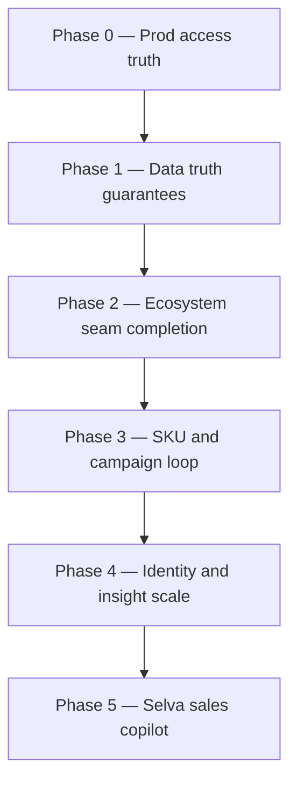

# Phynd CRM — Product and Engineering Roadmap

> **Canonical roadmap** for Phynd CRM. Supersedes scattered phase notes in README,
> PRD implementation callouts, and ad-hoc remediation docs when they conflict on
> sequencing or target state.
>
> **Last updated:** 2026-05-28  
> **Baseline evidence:** [`CODEBASE_AND_PROD_EVIDENCE_2026-07-09.md`](./CODEBASE_AND_PROD_EVIDENCE_2026-07-09.md) (supersedes the 2026-05-27 note)  
> **Master remediation plan:** [`MADFAM_TRUTH_LAYER_REMEDIATION.md`](./MADFAM_TRUTH_LAYER_REMEDIATION.md)  
> **Staging / PP.5:** [`PP_5_STAGING_AUDIT.md`](./PP_5_STAGING_AUDIT.md), [`PP_5_FULL_REMEDIATION_PLAN.md`](./PP_5_FULL_REMEDIATION_PLAN.md)

## North star

Deliver a **truthful, ecosystem-complete MADFAM tenant slice** at
`https://crm.madfam.io` where `admin@madfam.io` and the sales team (human and
Selva agents) can pilot on **live** data across clients, SKUs, visitors, and
cross-platform fulfillment — not demo fixtures or silent mock fallbacks.

## Current position (2026-05-28)

| Dimension | Capability built | Truthful in prod | Pilot-ready |
| --- | ---: | ---: | ---: |
| CRM core (contacts → orders) | ~85% | ~40–60% | ~55% |
| Federation SPOG (6 read providers) | ~75% | ~30–50% | ~40% |
| Full MADFAM ecosystem (~15 services) | ~30% | ~15–25% | ~10% |
| SKU catalog + Tulana loop | ~75% | ~40% (needs migrate) | ~55% |
| Universal visitors / identity graph | ~25% | ~15% | ~10% |
| Cross-ecosystem sales insight | ~60% CRM-native | ~20% federated | ~25% |
| Human sales pilot (`crm.madfam.io`) | ~75% UI | auth URLs verified | ~50% |
| Selva / AI sales copilot | ~40% | ~25% | ~30% |

**Distance from north star (two-axis, 2026-07-09):** capability built (code)
**~80–85%**; truthful-in-prod / pilot-ready **~30–55%** by dimension. Report the
axis, not a lone number — the earlier "~55–62% composite" and the README's
"~25–35%" measured different axes. Remaining distance is dominated by ops
execution and prod verification, not missing code. See
[`CODEBASE_AND_PROD_EVIDENCE_2026-07-09.md`](./CODEBASE_AND_PROD_EVIDENCE_2026-07-09.md).

## Phase map

Phases are **sequential gates** with parallel work inside each phase.

| Phase | Goal | Exit criteria (summary) | Target |
| --- | --- | --- | --- |
| **0** | Staff can log into `crm.madfam.io` | `/api/auth/providers` public URLs; Janua callback succeeds for `admin@madfam.io` | 2026-Q2 |
| **1** | No silent synthetic data in prod | Mock fallback off in prod; federation health visible; PP.5 webhook split verified | 2026-Q2 |
| **2** | Engagement timeline ecosystem-complete | Selva + Karafiel engagement events; outbound split to staging Karafiel/Cotiza/Dhanam | 2026-Q3 |
| **3** | SKU-aware campaigns | Tulana import, SKU schema, review UI, buyer-signal export | 2026-Q3 |
| **4** | Sales intelligence at scale | Identity graph hardening, cross-SKU analytics, Treasury Hunter prod gate | 2026-Q4 |
| **5** | Selva pilot | Service auth, agent manifest, integration probe, pilot runbook | **Shipped** (code) — ops per [`runbooks/PILOT_GO_LIVE.md`](./runbooks/PILOT_GO_LIVE.md) |

Detailed workstreams, owners, and acceptance tests live in
[`MADFAM_TRUTH_LAYER_REMEDIATION.md`](./MADFAM_TRUTH_LAYER_REMEDIATION.md).

---

## Phase 0 — Production access truth

**Owner:** Phynd CRM + Janua + Enclii  
**Blocks:** all human sales pilot on `crm.madfam.io`

| ID | Work item | Status | Doc / code |
| --- | --- | --- | --- |
| 0.1 | Deploy public-origin Auth.js normalization | Code ready | `apps/web/src/lib/auth/request.ts` |
| 0.2 | Verify `https://phynd.app/api/auth/providers` returns public hosts + callback host match | **Pass** (2026-05-28 — `pnpm verify:prod-auth`) |
| 0.2b | Post-deploy smoke (`verify-post-deploy`) wired in promote/rollback CI | **Shipped** (2026-05-29) |
| 0.3 | Reconcile Janua OIDC client (redirect URI, secret, token auth) | Open | `pnpm verify:janua-oidc` + Janua ops |
| 0.4 | Confirm `admin@madfam.io` tenant/admin claims in Janua | Open | `PHYND_APP_PRODUCTION_ACTIVATION_2026-05-14.md` |
| 0.5 | Reconcile Enclii junctions vs `.enclii.yml` domains | Open | Evidence § Enclii junctions |

---

## Phase 1 — Data truth guarantees

**Owner:** Phynd CRM + Platform  
**Depends on:** Phase 0 for prod verification

| ID | Work item | Status |
| --- | --- | --- |
| 1.1 | Wire host-derived `tenantId` in tRPC context (`crm.madfam.io` → `madfam`) | **Shipped** (2026-05-28) |
| 1.2 | Surface per-provider federation status in contact UI (no blank tabs) | **Shipped** — health banner + `loading.tsx` |
| 1.3 | Disable `tryGetMockFederationData` when `NODE_ENV=production` | **Shipped** (2026-05-28) |
| 1.4 | Document `DATABASE_URL_MADFAM` path; keep single DB until Phase 4 split | **Shipped** — [`TENANT_DATABASE_STRATEGY.md`](./TENANT_DATABASE_STRATEGY.md) |
| 1.5 | Complete PP.5 staging ingress + provider webhook env split | In progress — [`STAGING_INGRESS.md`](./runbooks/STAGING_INGRESS.md), [`PILOT_GO_LIVE.md`](./runbooks/PILOT_GO_LIVE.md) |
| 1.5b | Tier migration helper (`db:migrate:tier`) + post-deploy smoke script | **Shipped** (2026-05-29) |
| 1.6 | Nightly masked prod→staging refresh (or approved equivalent) | Deferred |

See PP.5 rows 12, 18, 19 in [`PP_5_STAGING_AUDIT.md`](./PP_5_STAGING_AUDIT.md).

---

## Phase 2 — Ecosystem seam completion

**Owner:** Phynd CRM + provider teams  
**Reference engagement:** [`runbooks/TABLACO_ENGAGEMENT.md`](./runbooks/TABLACO_ENGAGEMENT.md)

| ID | Work item | Status |
| --- | --- | --- |
| 2.1 | Selva → `POST /api/webhooks/selva` milestone wiring | **Shipped** (2026-05-28) — also `POST /api/v1/engagements/events` |
| 2.2 | Karafiel → engagement events (CFDI/NOM-151 milestones) | **Shipped** (2026-05-28) on `/api/webhooks/karafiel` when `engagement_id` present |
| 2.3 | Pravara `engagementId` direct in webhook payload | Future enhancement |
| 2.4 | Outbound split: Karafiel, Cotiza, Dhanam staging URLs + secrets | **Partial** — `outbound-guard` blocks staging→prod; Enclii URL wiring open |
| 2.5 | Federation profile: Karafiel compliance summary (read) | **Shipped** — `karafielCompliance` on unified profile + contact panel (`treasuryHunter`) |
| 2.6 | Tezca: replace hardcoded `tezca: 'ok'` with on-demand fetch or honest `unavailable` | **Shipped** (2026-05-28) |

---

## Phase 3 — SKU and campaign loop

**Owner:** Phynd CRM + Tulana + Selva  
**Contract:** [`TULANA_SKU_CAMPAIGN_INPUTS_2026-05-29.md`](./TULANA_SKU_CAMPAIGN_INPUTS_2026-05-29.md)

| ID | Work item | Status |
| --- | --- | --- |
| 3.1 | `sku_catalog` + campaign extension schema + migration | **Shipped** — `0008_orange_sandman.sql` |
| 3.2 | `POST /api/v1/campaigns/import` (Tulana/Selva, idempotent) | **Shipped** (2026-05-28) |
| 3.3 | Review UI: platform, SKU, `ga_readiness`, `do_not_claim` | **Shipped** (filters + review dialog + approve/reject guardrails) |
| 3.4 | Consent/suppression send gates | **Shipped** (`checkSendEligibility`, `attemptTulanaSend`, `/api/v1/campaigns/send`) |
| 3.5 | Buyer-signal export to Tulana (PII-redacted) | **Shipped** (`campaign_buyer_signals`, `POST /api/v1/campaigns/buyer-signals`) |

---

## Phase 4 — Identity graph and sales insight

**Owner:** Phynd CRM + Janua Telemetry + Analytics

| ID | Work item | Status |
| --- | --- | --- |
| 4.1 | Harden Janua `user.created` + Tezca interest/newsletter linking | Shipped (verify prod) |
| 4.2 | Visitor identify pipeline prod verification | **Shipped** — `visitor.identified` webhook + `session-identify` enqueue |
| 4.3 | Cross-SKU funnel analytics (depends Phase 3) | **Shipped** — `skuCampaignFunnel` + `skuBuyerSignalFunnel` on `/analytics` |
| 4.4 | RouteCraft payment attribution dashboards | **Shipped** — `paymentAttributionSummary` + `/analytics` card; webhook tenant + `campaignId` link |
| 4.5 | Enable `treasuryHunter` in prod with HITL gate | **Shipped** — `FEATURE_TREASURY_HUNTER` env override, HITL status gates, Karafiel `grant.awarded` dispatch |
| 4.6 | Enable `observability` (Sentry/OTel) rollout | **Partial** — worker OTel + Sentry; web OTel deferred (Next build traces gRPC) |
| 4.7 | Optional: `DATABASE_URL_PHYND` for commercial tenant slice | Future |

---

## Phase 5 — Selva sales copilot

**Owner:** Phynd CRM + Selva (selva-office)

| ID | Work item | Status |
| --- | --- | --- |
| 5.1 | Expand `FEDERATION_API_TOKEN` scopes (contacts, opps, profile, engagements, analytics) | **Shipped** (2026-05-28) |
| 5.2 | Janua service account for Selva with least-privilege scopes | **Shipped** — `service:selva` principal + audit log |
| 5.3 | GraphQL or OpenAPI agent tool manifest for Selva office | **Shipped** — `docs/SELVA_CRM_AGENT_TOOLS.md` |
| 5.4 | PII masking (`piiMasking` flag) before LLM context export | **Shipped** — service-auth masking in search + unified profile |
| 5.5 | `aiKanban` human-in-the-loop sales suggestions | **Shipped** — `ai_kanban_suggestions` + review panel on `/pipeline`; `FEATURE_AI_KANBAN` |
| 5.6 | Selva Panopticon dashboard iframe embed | **Shipped** — `PHYND_SELVA_EMBED_ALLOWED` + CSP `frame-ancestors` middleware |

---

## UI / quality backlog (parallelizable)

Tracked from ecosystem audit 2026-04-23; not phase-gating but required for sales polish.

| Item | Priority | Status |
| --- | --- | --- |
| Federation tab `Suspense` + skeleton loaders | P1 | **Shipped** — `clients/[id]/loading.tsx` |
| Delete confirmation on leads/opportunities | P1 | **Shipped** (2026-05-28) |
| Sidebar nav `aria-label` | P2 | **Shipped** (2026-05-28) |
| `next-intl` for Mexico market | P3 | Planned |
| E2E auth fixture (stop skipping search tests on `/login`) | P2 | **Shipped** — `e2e/fixtures/auth.ts` + Playwright `AUTH_BYPASS` webServer env |

---

## Feature flags — rollout schedule

| Flag | Default | Target phase | Notes |
| --- | --- | --- | --- |
| `bidirectionalSync` | on | — | Keep on |
| `leadScoring`, `visitorTracking`, `analytics` | on | — | Keep on |
| `multiTenancy` | on | Phase 1 | Wire host → tenantId |
| `treasuryHunter` | off (enable via `FEATURE_TREASURY_HUNTER=true`) | Phase 4 | Grants pipeline + HITL |
| `observability` | off (enable via `FEATURE_OBSERVABILITY=true`) | Phase 4 | Sentry + OTel |
| `piiMasking` | off | Phase 5 | Selva context |
| `aiKanban` | off (enable via `FEATURE_AI_KANBAN=true`) | Phase 5 | Pipeline HITL suggestions |
| `realtimeUpdates` | off | Phase 5+ | Post-copilot |

---

## Related documents

| Document | Role |
| --- | --- |
| [`MADFAM_TRUTH_LAYER_REMEDIATION.md`](./MADFAM_TRUTH_LAYER_REMEDIATION.md) | Full workstream plan, acceptance tests, owners |
| [`PP_5_FULL_REMEDIATION_PLAN.md`](./PP_5_FULL_REMEDIATION_PLAN.md) | Staging pipeline and webhook split |
| [`runbooks/PILOT_GO_LIVE.md`](./runbooks/PILOT_GO_LIVE.md) | Enclii-first pilot checklist (migrate, secrets, webhooks, Selva) |
| [`CLIENT_PROJECT_ONBOARDING.md`](./CLIENT_PROJECT_ONBOARDING.md) | Engagement onboarding operator flow |
| [`runbooks/TABLACO_ENGAGEMENT.md`](./runbooks/TABLACO_ENGAGEMENT.md) | Reference engagement (Tablaco) |
| [`TULANA_SKU_CAMPAIGN_INPUTS_2026-05-29.md`](./TULANA_SKU_CAMPAIGN_INPUTS_2026-05-29.md) | SKU campaign contract |
| [`ENGAGEMENT_EVENT_TAXONOMY.md`](./ENGAGEMENT_EVENT_TAXONOMY.md) | Cross-producer milestone vocabulary |
| [`CODEBASE_AND_PROD_EVIDENCE_2026-05-27.md`](./CODEBASE_AND_PROD_EVIDENCE_2026-05-27.md) | Latest prod verification |
| [`PRD.md`](../PRD.md) | Strategic baseline (historical phasing) |

---

## Maintenance

When closing a roadmap item:

1. Update the status column in this file.
2. Add evidence to `CODEBASE_AND_PROD_EVIDENCE_YYYY-MM-DD.md` or a phase closeout note.
3. Regenerate agent indexes: `internal-devops/scripts/sync-agent-docs.py` (ecosystem).
