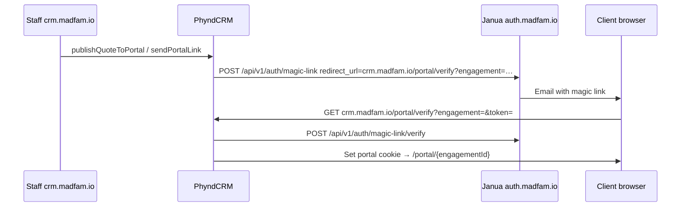

# Janua portal magic-link redirect URIs

> Last updated: 2026-06-22  
> Related: [`verify-janua-oidc-checklist.mjs`](../../scripts/verify-janua-oidc-checklist.mjs), [`DOMAIN_ROUTING_POLICY_2026-05-15.md`](../DOMAIN_ROUTING_POLICY_2026-05-15.md)

## Why this matters

MADFAM staff use **`https://crm.madfam.io`** (Janua OIDC). External clients receive a **Janua magic-link email** when staff publish a quote or send a portal link.

PhyndCRM builds the Janua `redirect_url` as:

```text
{PORTAL_BASE_URL}/portal/verify?engagement={id}
```

Production **`PORTAL_BASE_URL` must be `https://crm.madfam.io`** so clients land on the MADFAM-branded host, not `phynd.app`.

## Janua admin checklist

### 1. Staff OIDC (already required)

Register on the Phynd CRM Janua OIDC client:

| Environment | Redirect URI |
|---|---|
| Production MADFAM | `https://crm.madfam.io/api/auth/callback/janua` |
| Production generic | `https://crm.phynd.app/api/auth/callback/janua` |
| Staging | `https://staging-crm.madfam.io/api/auth/callback/janua` |

Verify live:

```bash
pnpm verify:janua-oidc -- --verify-live
```

### 2. Client portal magic-link (Janua `CORS_ORIGINS`)

Janua validates magic-link `redirect_url` hosts from deployment env **`CORS_ORIGINS`**
(see `janua/apps/api/app/core/url_security.py`) — **not** a separate path-prefix list
and **not** the admin CORS DB settings alone.

Production **`janua-api`** must include these origins in `CORS_ORIGINS`:

| Origin | Purpose |
|--------|---------|
| `https://crm.madfam.io` | MADFAM staff + client portal magic links |
| `https://crm.phynd.app` | Generic PhyndCRM app host |
| `https://phynd.app` | Marketing / legacy portal fallback |
| `https://www.phynd.app` | Marketing alias |
| `https://staging-crm.madfam.io` | Staging portal |

Path `/portal/verify?engagement=&token=` is allowed automatically once the **host** is trusted.

Verify on a running `janua-api` pod:

```bash
kubectl exec -n janua deploy/janua-api -- python -c "
from app.core.url_security import is_safe_redirect_url
print(is_safe_redirect_url('https://crm.madfam.io/portal/verify?engagement=x&token=y'))
"
# Expected: True
```

GitOps: patch `janua/k8s/base/deployments/janua-api.yaml` and roll out with a **pinned
image digest** — `:main` currently crashes (SQLAlchemy `metadata` reserved name, 2026-06-22).

**Do not** register only `https://phynd.app/portal/verify` for production MADFAM clients.

### 3. PhyndCRM env

| Var | Production value |
|---|---|
| `PORTAL_BASE_URL` | `https://crm.madfam.io` |
| `JANUA_API_URL` | `https://auth.madfam.io` |

Kubernetes: `phynd-crm-pilot-overlay` secret in namespace `phynd-crm`. Template: [`infra/k8s/production/pilot-overlay-template.yaml`](../../infra/k8s/production/pilot-overlay-template.yaml).

Verify:

```bash
node scripts/verify-client-lifecycle-env.mjs --from-k8s production
pnpm pp5:prod-lifecycle-handoff
```

After changing the secret, restart web + worker:

```bash
kubectl rollout restart deployment/phynd-crm-web deployment/phynd-crm-worker -n phynd-crm
```

## End-to-end flow



## Acceptance

- [ ] `verify-client-lifecycle-env --from-k8s production` reports `PORTAL_BASE_URL` = `https://crm.madfam.io`
- [ ] Janua admin confirmed portal verify origin allowlist includes `crm.madfam.io`
- [ ] Test magic link from staging first (`staging-crm.madfam.io`)
- [ ] First prod client: publish quote → client email → portal timeline loads on `crm.madfam.io`
